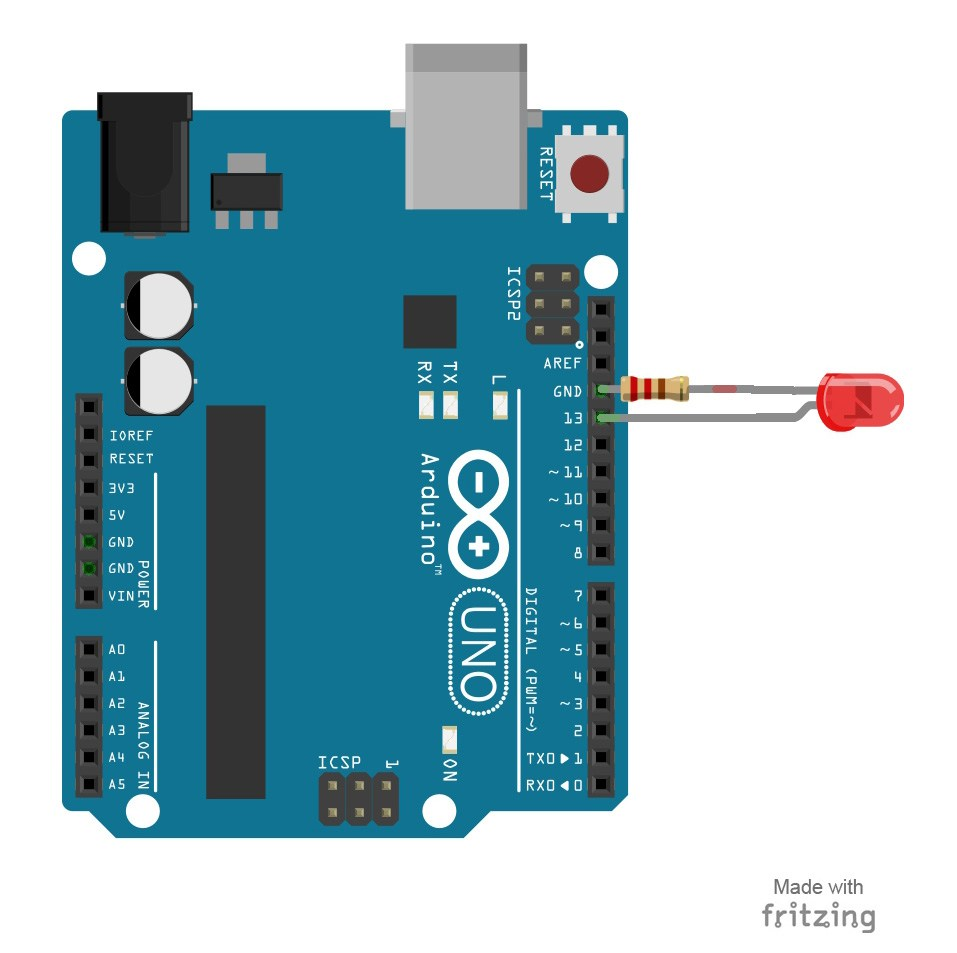

# 1 – Blink an LED without breadboard
The first project is one of the most basic and simple circuits you can create with Arduino.  This project will test your Arduino by blinking an LED that is connected directly to the board.
## Parts Needed
- (1) Arduino Uno
- (1) USB A-to-B Cable
- (1) LED 5mm
- (1) 220 Ω Resistor

## Project Diagram

## Project Steps
1. Twist a 220 Ω resistor to the long leg (+) of the LED.
2. Push the short leg of the LED into the ground (GND) pin on the board.
3. Push the resistor leg that’s connected to the LED into the #13 pin.

#### side note
LED has two legs, the long one is the + of the LED and the short one is -
