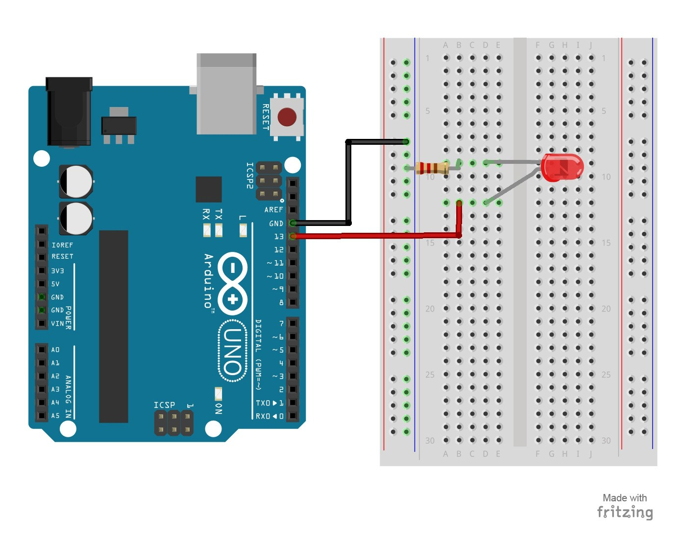
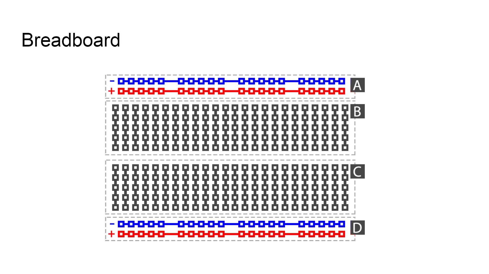

# 1 – Blink an LED without breadboard
This project is identical to project #1 except that we will be building it on a breadboard.  Once complete, the LED should turn on for a second and then off for a second in a loop.
## Parts Needed
- (1) Arduino Uno
- (1) USB A-to-B Cable
- (1) Breadboard – Half Size
- (1) LED 5mm
- (1) 220 Ω Resistor
- (2) Jumper Wires

## Project Diagram

#### side note
Breadboard has power rails(Vertically) on both sides of the breadboard and all of the pin on the rail is connected. Please check the internal image of the Breadboard
Every pin on the Terminal Strips(Horizontally) is connected to each other.

-[How to Use BreadBoard](https://learn.sparkfun.com/tutorials/how-to-use-a-breadboard)
