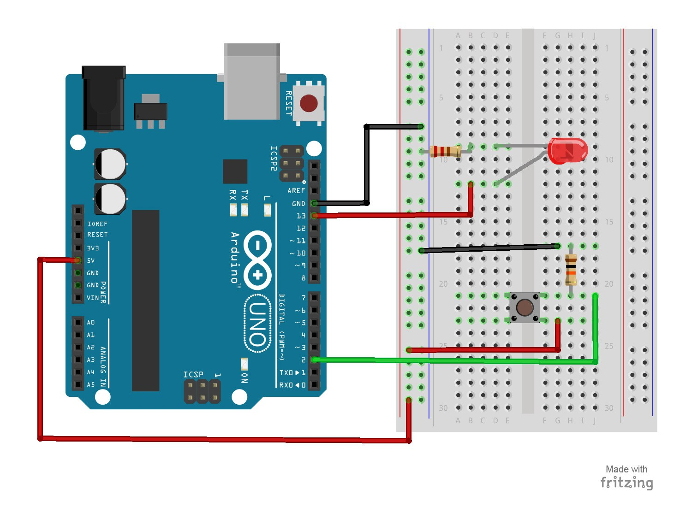

# 3 – Push Button
Using a push button switch, you will be able to turn on and off an LED.
## Parts Needed
- (1) Arduino Uno
- (1) USB A-to-B Cable
- (1) Breadboard – Half Size
- (1) LED 5mm
- (1) 220 Ω Resistor
- (1) 10K Ω Resistor
- (1) Push Button Switch
- (6) Jumper Wires

## Project Diagram

#### side note
Here, when the button pressed, the 5v will be sent to pin 2.
There's another way to set up a button, which would use the Arduino's internal pull up resistor.
Here is the [Tutorial Link](https://www.arduino.cc/en/Tutorial/InputPullupSerial).
