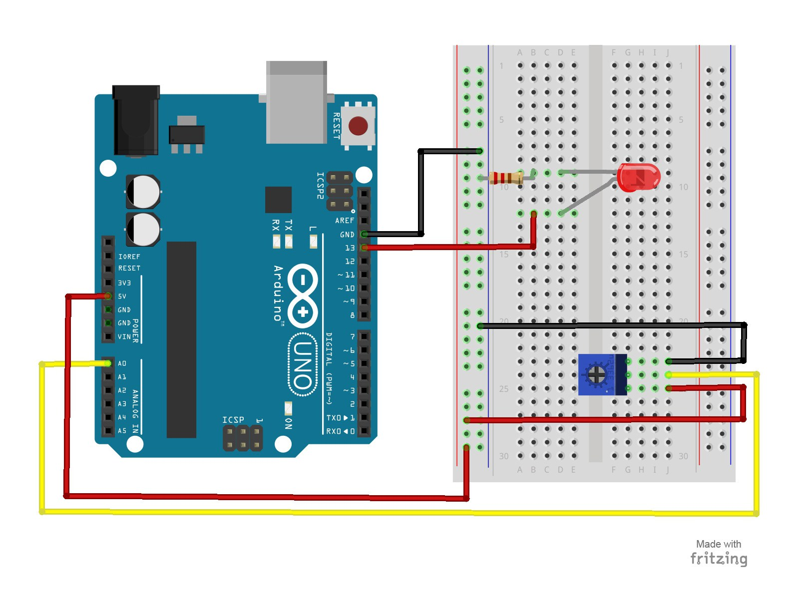

# 4 – Potentiometer

## [Online Simulator](https://www.tinkercad.com/things/b7klg1bY0uT)


Using a potentiometer, you will be able to control the resistance of an LED.  Turning the knob will increase and decrease the frequency the LED blinks.
## Parts Needed
- (1) Arduino Uno
- (1) USB A-to-B Cable
- (1) Breadboard – Half Size
- (1) LED 5mm
- (1) 220 Ω Resistor
- (1) Potentiometer (10k Trimpot)
- (6) Jumper Wires

## Project Diagram



#### side note
In the code, there is a challenge which is trying to use the potentiometer to control the brightness of the LED.
Here is the final code, you may would like to know.

```c++
int sensorPin = A0;
int ledPin = 13;  
int sensorValue = 0;

void setup() {
  pinMode(ledPin, OUTPUT);
}

void loop() {
  sensorValue = analogRead(sensorPin);
  sensorValue = map(sensorValue, 0, 1023, 0, 255);
  analogWrite(ledPin, sensorValue);
}

```
