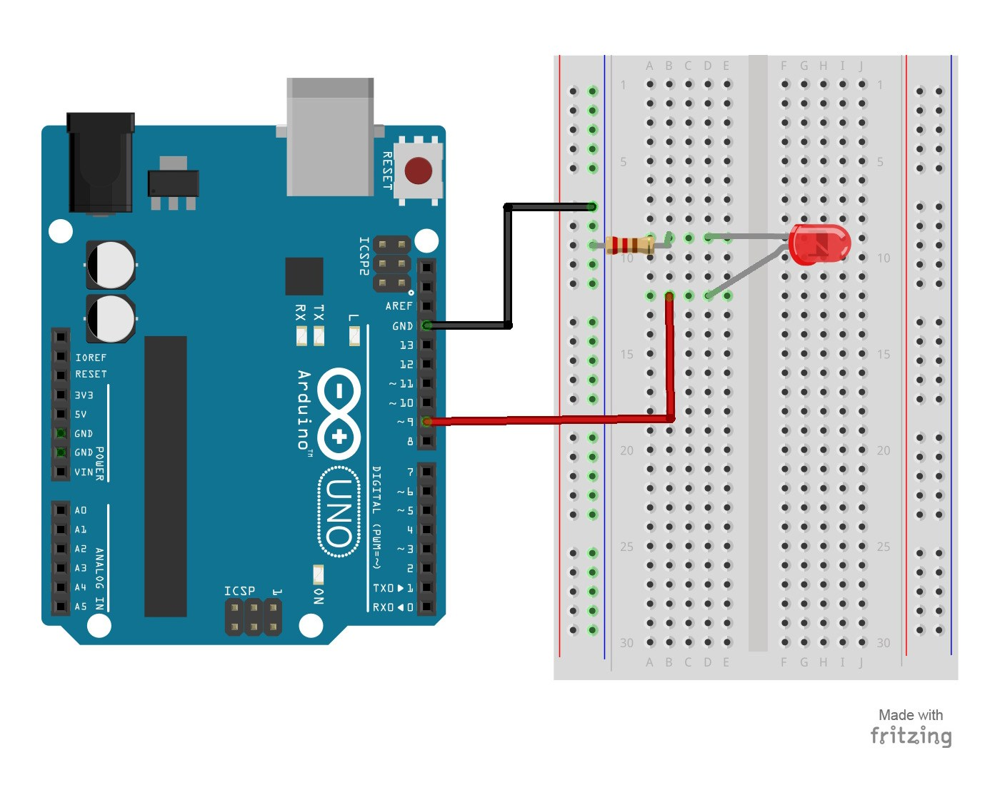

# 5 – Fade an LED

## [Online Simulator](https://www.tinkercad.com/things/5wW0sEOrA7H)

By using a PWM pin on the Arduino, you will be able to increase and decrease the intensity of brightness of an LED.

## Parts Needed

- (1) Arduino Uno
- (1) USB A-to-B Cable
- (1) Breadboard – Half Size
- (1) LED 5mm
- (1) 220 Ω Resistor
- (2) Jumper Wires

## Project Diagram

#### More Reading
- [PWM](https://www.arduino.cc/en/Tutorial/PWM)
- [Secret of Arduino PWM](https://www.arduino.cc/en/Tutorial/SecretsOfArduinoPWM)
