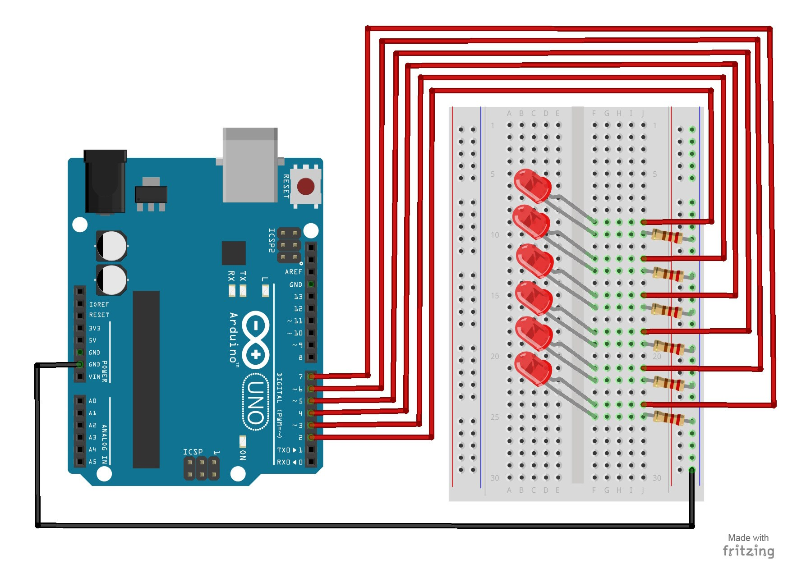

# 6 – Scrolling LED

This project will blink 6 LEDs, one at a time, in a back and forth formation.  This type of circuit was made famous by the show Knight Rider which featured a car with looping LEDs.

## Parts Needed
- (1) Arduino Uno
- (1) USB A-to-B Cable
- (1) Breadboard – Half Size
- (6) LED 5mm
- (6) 220 Ω Resistor
- (7) Jumper Wires

## Project Diagram

