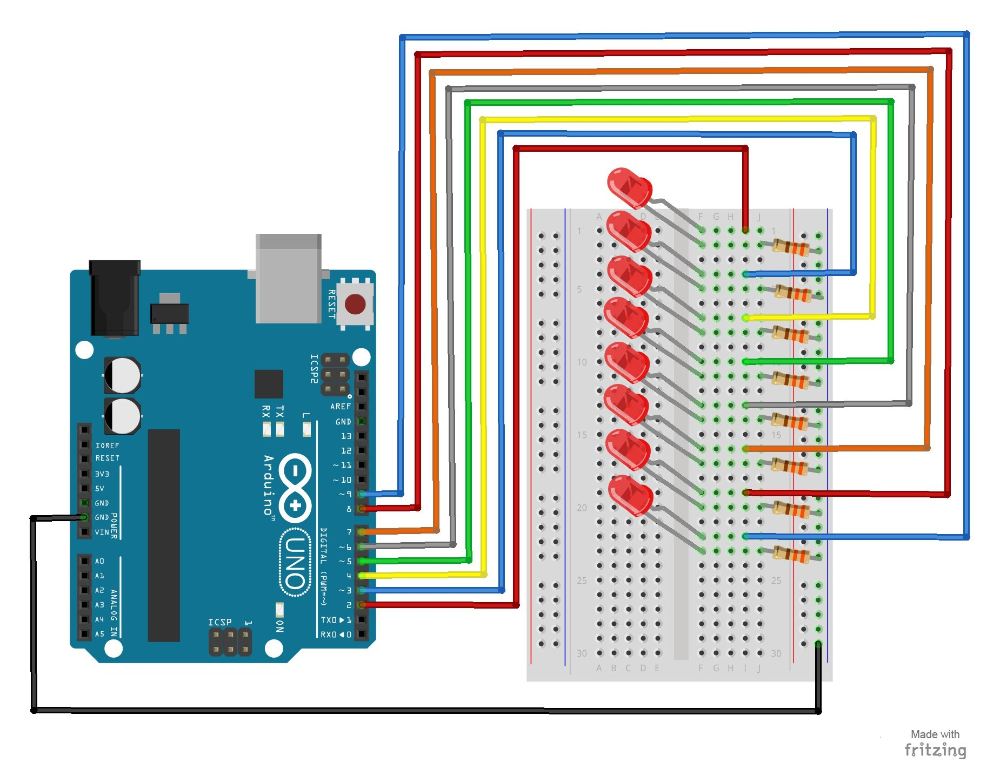

# 8 – Multiple LEDs

This project will use 8 pins on the Arduino board to blink 8 LEDs at the same time.

## Parts Needed
- (1) Arduino Uno
- (1) USB A-to-B Cable
- (1) Breadboard – Half Size
- (8) LED 5mm
- (8) 330 Ω / 220 Ω Resistor
- (9) Jumper Wires

## Project Diagram


## code
There are four different function you may try.
```c++
oneAfterAnother();  
// Light up all the LEDs in turn

oneOnAtATime();        
 // Turn on one LED at a time

pingPong();             
// Same as oneOnAtATime() but change direction once LED reaches edge

marquee();              
// Chase lights like you see on theater signs

randomLED();
// Blink LEDs randomly
```

#### More readings
[Random](https://www.arduino.cc/reference/en/language/functions/random-numbers/random/)
