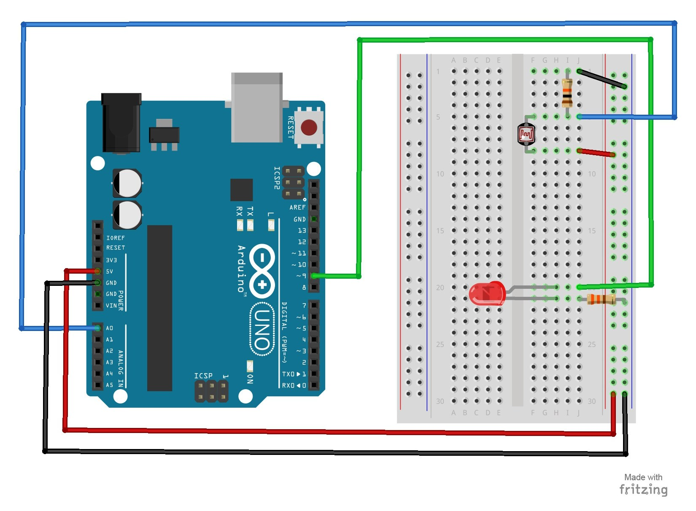

# 10 – Photoresistor
A photoresistor changes the resistance a circuit gets based on the amount of light that hits the sensor.  In this project, the brightness of the LED will increase and decrease based on the amount of light present.
## Parts Needed
- (1) Arduino Uno
- (1) USB A-to-B Cable
- (1) Breadboard – Half Size
- (1) LED 5mm
- (1) 330 Ω Resistor
- (1) 10K Ω Resistor
- (1) Photoresistor
- (6) Jumper Wires
## Project Diagram



## Code
You may need to run this code and use the Serial Monitor (Tools->Serial Monitor) to figure out the min and max light brightness in the room settings and change the two values in the code.
```c++
int maxThreshold = 0;    
 // used for setting the "max" light level
int minThreshold = 1023;  
 // used for setting the "min" light level

```

## More Readings
- [Using a photo cell](https://learn.adafruit.com/photocells/using-a-photocell)
- [My previous project which uses LED and Solar panel to create LiFi, visible light communication system](https://github.com/ramonidea/LI-FI-Arduino)
