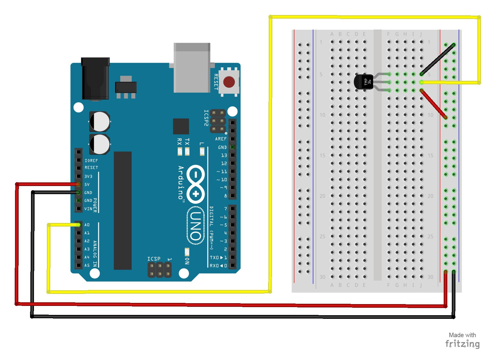

# 11 – Temperature Sensor
A temperature sensor measures ambient temperatures of the world around it.  In this project, we will be displaying the temperature in the serial monitor of the Arduino IDE.
## Parts Needed
- (1) Arduino Uno
- (1) USB A-to-B Cable
- (1) Breadboard – Half Size
- (1) Temperature Sensor – TMP36
- (5) Jumper Wires
## Project Diagram

## More Readings (Other Temp. Sensor)
- [DHT Temp. Sensor](https://www.adafruit.com/product/385)
- [Driver](https://github.com/ramonidea/Greenhouse-Arduino-GoogleSheetSync/tree/master/Adafruit%20DHT%20Arduino%20Library)
- Wiring Diagram 
