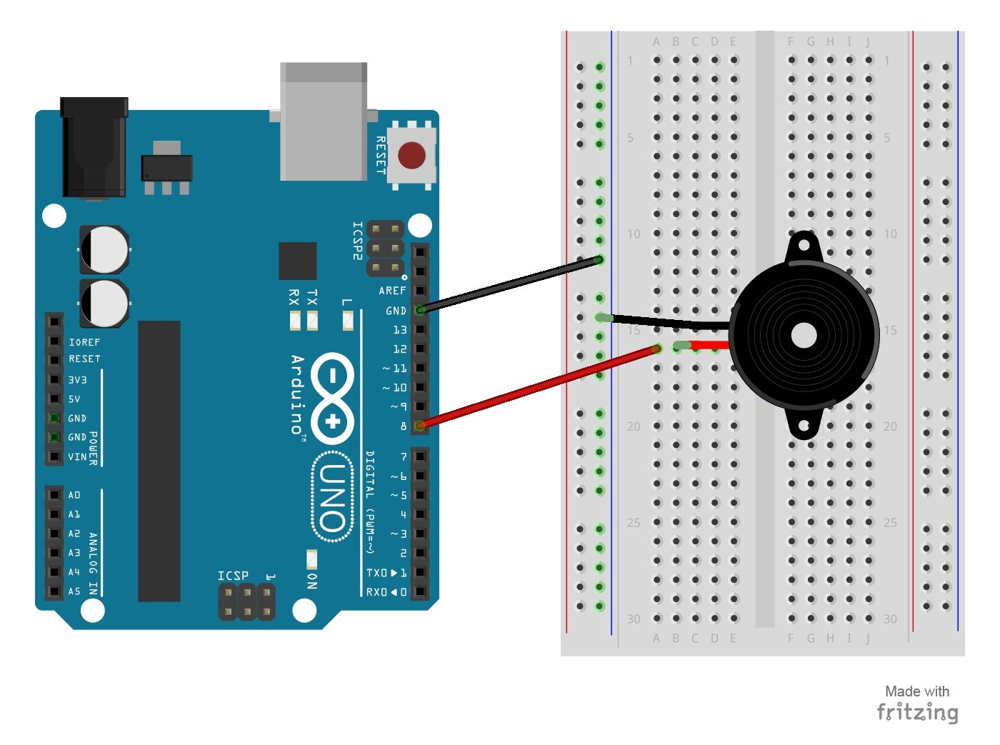

# 12 – Tone Melody
The project will use a piezo buzzer/speaker to play a little melody.
## Parts Needed
- (1) Arduino Uno
- (1) USB A-to-B Cable
- (1) Breadboard – Half Size
- (1) Piezo Buzzer/Speaker
- (2) Jumper Wires
## Project Diagram

## More Songs
- [Star War Song](https://gist.github.com/nicksort/4736535)
- [Super Mario](https://www.google.com/url?sa=t&rct=j&q=&esrc=s&source=web&cd=1&cad=rja&uact=8&ved=0ahUKEwj7iZnMm73YAhVD02MKHZAXAMAQFggpMAA&url=https%3A%2F%2Fwww.princetronics.com%2Fsupermariothemesong%2F&usg=AOvVaw1xKXTey8r3p8hPGc8Acy87)
- [Pirates of the Caribbean Theme Song](https://github.com/xitangg/-Pirates-of-the-Caribbean-Theme-Song/blob/master/Pirates_of_the_Caribbean_-_Theme_Song.ino)
